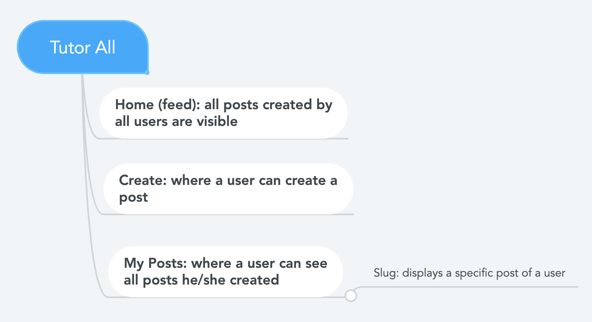

# Tutor All


## Overview

It is easy for college students to be often stuck with so many questions without answers, whether they be about academics, careers, relationships, or themselves.

Tutor All is a web app that will allow users to seek advices about anything from fellow students. Students who want to participate as mentees can ask about anything specific or general - from specific skills or materials to learn to get a head start in a particular course, or recruiting experience for a specific company, to a general advice on getting along with new roommates. This website is also useful for those who want to participate as mentors. They can make posts to share their expertise in any fields or comment on any mentee's post to indicate that they are willing to be of help as a mentor. 
By allowing students who are not in a particular club/society/community/network a broader access to the fields that they would like to share insights and learn more about, Tutor All aims to broaden the learning horizon for all of its users while personalizing the target group and experiences to those who attend the same school. 


## Data Model

The application will store Users and Posts.
The following will describe to you the data model of this website as well as how to get started with using this website in detail:

* Before even getting started, please enter this link with 'https', not 'http'. This was required in order to proceed with Facebook Oauth. 
	* https://linserv1.cims.nyu.edu:27193/
	* If you get a warning for it not being a secure website, please proceed with 'proceed anyway' option -- this will make the website load. 

* A first-time visitor/user can view the posts that have been created by other users in a chronological user. However, a user who has not signed in through Facebook is not authorized to create any comment (If you try to look for the input form to create a comment, it won't be visible.)

* Therefore, before you get started with actually using the website's features, please log in by using Facebook. This is pretty simple on the user's end:
	* Press 'login' from the navigation bar.
	* Once you successfully login thoruhg Facebook, the website will welcome you, and the 'Login' option from the navigation bar will no longer be visible to you. 

* Once you are have successfully signed in using Facebook, you can now create comments on any posts visible on the home page.

* Users can also create a post/ multiple posts (a user creates one post at a time).
	* When creating a post, please follow do so in this format:
		* Post type will either be "Mentor", or "Mentee": first cap and all else lowercases.
		* Area of interest will also be first cap and all else lowercases. For "Student life", with two words, only make the first letter of the first word capital, and the rest will be lowercase.
		* Area of interest will be one of the following (these are the fixed categories that I have created to keep this web app organized): Academics, Career, Entertainment, Student life, Miscellaneous. 
* Users can also delete their post (one post at a time).
	* I have created a button next to each post on 'my posts' page. 
		* If the user presses 'delete' button, the post will be deleted and the user will be redirected to home page with the newly modified results that excludes the data that was just deleted by the user. 

* Post can be of two types: created by a mentor, or by a mentee.
	* The content will look similar to some extent. (i.e. how to contact the user that created the post, what is the post about, etc)

* Post will have relevant areas of interests (i.e. academics, career, miscellaneous).

* Users can narrow down their search using forms (search by post type, or area of interest).
	* When searching, please type out a full length word 
		* (mentee, Mentee, mentor, Mentor for post types)
		* (entertainment, Entertainment, academics, Academics,...)
		* Basically only takes either all-lowercase, or first-cap-all-else-lowercase.
		* Also doesn't take an incomplete keyword such as "men" or "academ".
		* Doesn't take all-caps words either.


```javascript
{
  username: String,
  password: String,
}
```

An Example Post with Embedded Items:

```javascript
{
  user: {type: String, required: true},
  postType: {type: String, required: true}, // as a mentee, as a ment]or
  area: {type: String, required: true}, // academics, career, general
  postName: {type: String, required: true},
  targetYear: {type: Number, min: 1, required: false},
  userEmail: {type: String, required: true},
  userPhone: {type: String, required: true},
  detail: {type: String, required: false},
  comments: {type: [String], required: false}, // "Contact me".[email, phone]"
  createdAt: {type: Date, required: false},
  closeAt: {type: Date, required: false},
}
```


## [Link to Commented First Draft Schema](db.js) 


## Wireframes

/ - page that displays all posts created by all users


/create - page for creating a new post


/mine - page for showing all posts


/slug doesn't exist anymore, as I have realized that this feature doesn't necessarily add any value to this website.


## Site map




## User Stories or Use Cases

1. as non-registered user, I can register a new account with the site through Facebook.
2. as a user, I can log in to the site
3. as a user, I can create a request for people to be my tutor, or post about her/his field of knowledge and advertise as a mentor/tutor.
4. as a user, I can view all of the posts I have created.
5. as a user, I can add comments to all the posts that I can see. 
6. as a user, I can remove my previous posts in 'my posts' page.


## Research Topics
* (10 points) Integrate user authentication
    * I have used passport.js for user authentication. Because this research topic was so, so much more complicated than I have expected, I have increased the points :)
	* While debating between using local strategy or oauth, I decided to go with oauth, since I assume that this is a more modern way of signing into a website. 
		* The user can spend much less amount of time trying to sign in to the website, and this is the way how I sign into most websites these days. 
	* I had to declare the next actions in cases where the user either successfully signs in, or fails to do so - redirect links. 
    	* I also had to go on Facebook developer app, register myself as a student developer, get an ID and a callback url to start with. 
		* This part was a huge bottleneck since Facebook only allows the use of 'https', not 'http'.
		* Therefore, I had to change my http://localhost and the remote server to https.
		* Doing so required me to self-sign a SSL certificate that would allow chrome to allow me to proceed with a 'not secure' link.
		* This involved a lot of research, and had to download key.pem and cert.pem files. 
	* The authentication methodology is also embedded in each of the pages of this website, since whether the user has signed in or not determines the scope of permitted activities on each page. 
		* For example, this web app checks if the user has signed in on 'create a post' page and 'my posts' page. If the user didn't sign in, the page won't be rendered, and the user will be redirected to the login page.

* (2 points) Use a CSS framework throughout your site, use a reasonable of customization of the framework:
    * Bootstrap
	* Currently used nav-bar, nav, carousel, forms, cards, and buttons.
		* Learned that a lot of my bootstrap components work with setting specific bootstrap classes, and I can customize the way they appear by adding specific styles.  
	* Gave 'yellow' theme to the website, because it is my personal favorite color. 

12 points total out of 8 required points.


## [Link to Initial Main Project File](app.js) 


## Annotations / References Used
1. [passport.js authentication docs](http://passportjs.org/docs) (https://developers.facebook.com/apps/471977113447857/fb-login/quickstart/) (https://github.com/jaredhanson/passport-facebook) (https://www.corvil.com/kb/how-do-you-get-chrome-to-accept-a-self-signed-certificate) (https://stackoverflow.com/questions/52850733/redirect-uris-are-not-allowed-in-facebook-valid-oauth-redirect-uris) (https://nodejs.org/en/knowledge/HTTP/servers/how-to-create-a-HTTPS-server/) (https://timonweb.com/posts/running-expressjs-server-over-https/) (https://gist.github.com/travisvalentine/8796187) 
2. [bootstrap](https://getbootstrap.com/)

